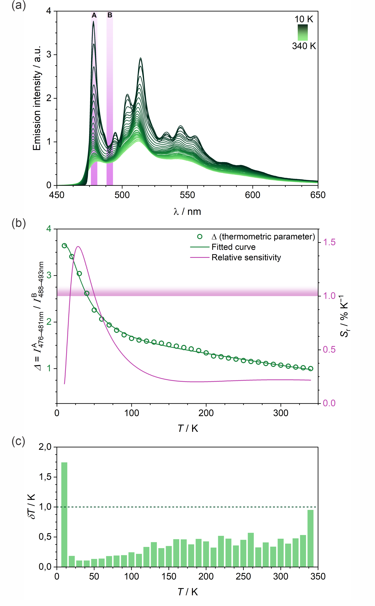

# lumTherm
A software for analysis of optical thermometry.

## Overview

Luminescent thermometry is one of the possibilities for optical redout of temperature. It works by exploring T-dependent emission spectra of luminescent species. In particular, a thermometric parameter monitoring a change in ratio of emission intensity in two different parts of the spectrum is often used (Figure 1). This software aims to facilitate finding the optimal wavelength, for which the ratios should be calculated to achieve highest sensitivity and lowest redout errors.  
**LumTherm** is based on a brute-force approach in which the ratio between all pairs of wavelengths is calculated for all temperatures. Then, the graphical interface involving sensitivity heat-maps will help the user finding the ones optimal for them. The chosen results may then be exported as plain `.txt` or `.csv` data for calibration curve fitting and further analysis.

<figure>
    
    <figcaption>Fig. 1. An exeplary set of T-dependent emission spectra (a) for a platinum complex, with sensitivity analysis on (b) and temperature redout error on (c). For more information, see oryginal publication; DOI: 0.26434/chemrxiv-2025-70v85 </figcaption>
</figure>

## Backend

### 1. Packages

The program uses:
* Pandas
* Numpy
* PyQt6
* pathlib
* [...]

Details in `requirenments.txt`

### 2. Data

The imported data will be stored as Panda's dataframe.

The analyzed data will be stored as a series of 3D NumPy arrays (or xarray, to be determined) with `x` and `y` representing wavelengths and `z` temperatures. The axes will not be a part of the array. Three such arrays will be necessary:
* intensity ratios
* their derivative over T
* their teperature redout error  

Float32 will be used to reduce memory consumption (6-8 significant digits, should be enough). One array with processed data will be of size about: 2000 x 2000 x 40. This gives 160 000 000 numbers, 1.28 GB with float64, but only half of that with float32. The data menagment is the bigest chalenge of the project.

The metadata will be stored in a dictionary.

Current state of the program should be writable to .h5

### 3. Classes

#### LumFile

Current state of the program. Handels writing and reading form .h5

#### LumSpectrum

Handels the data. Collects the functions for data analysis.

[...]

## Frontend

### 1. Windows
The graphical interface involves several windows.

#### The main window

Displays the data. 

[...]

#### Data import window

Allows to read data from a text file. An interface to use `from_csv()` function from Pandas.

It contains:

* **the browse section** with file path and 'browse' button
* **the table preview** updated continuously
* **the import settings** allowing to set:
    - delimiter (text)
    - rows to skip (list)
    - columns to skip (list)
    - columns headings (list or range)
* **the saving section** allowing to add or replace existing data. 

#### Smooth/background window

Handels the smoothing, background subtraction and uncertainty determination

#### Data export window

Allows to save results to .json, .csv or .opju

#### File browsing windows (open and save)

Provided within the PyQt6 library.

[...]

