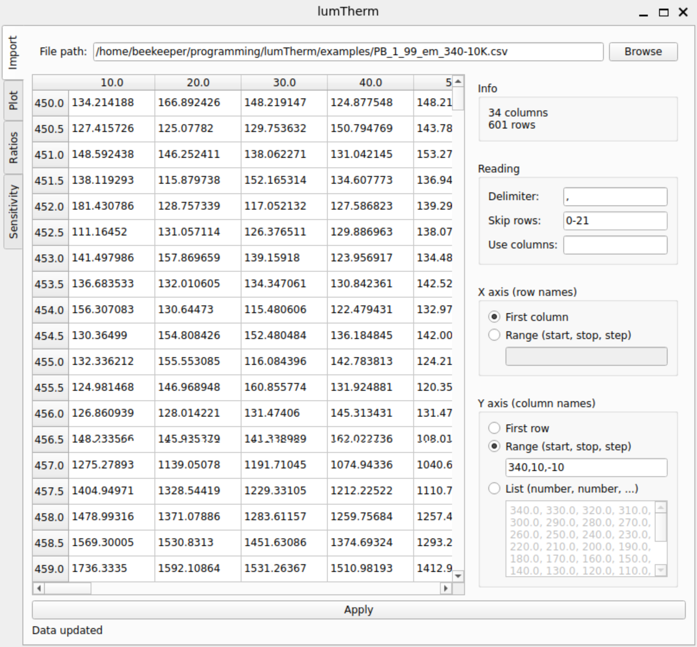
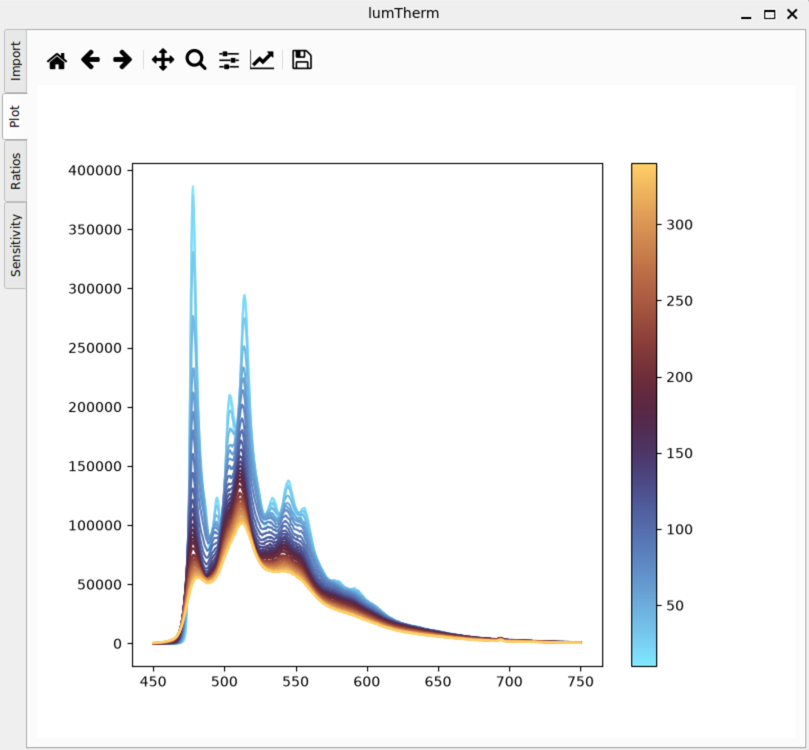
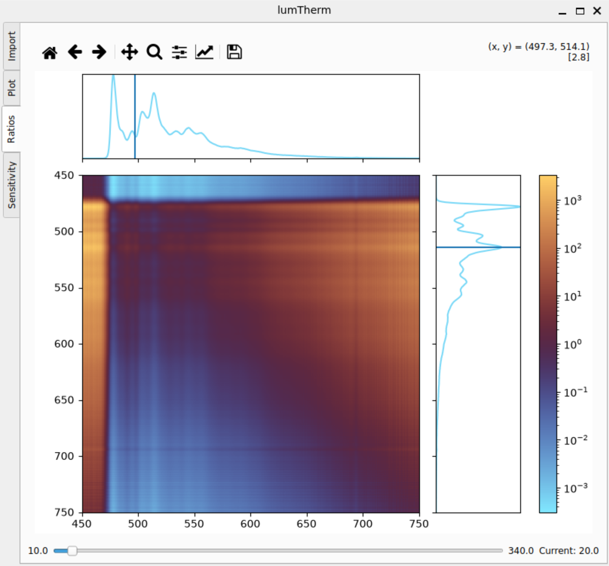
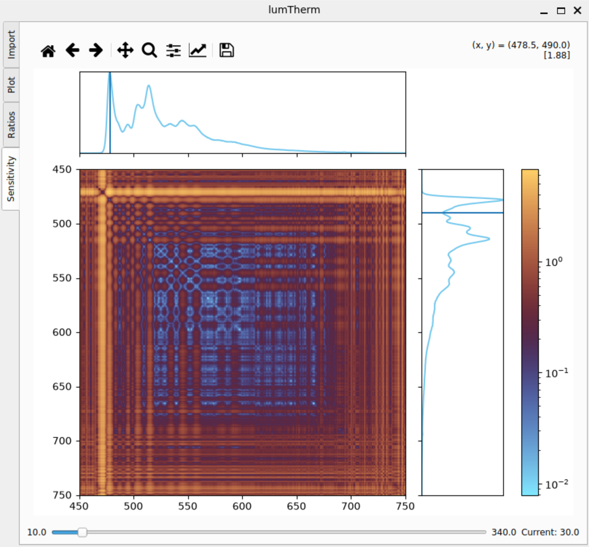

# lumTherm
A software for analysis of optical thermometry.

## Overview

Luminescent thermometry is one of the possibilities for optical redout of temperature. It works by exploring T-dependent emission spectra of luminescent species. In particular, a thermometric parameter monitoring a change in ratio of emission intensities in two different parts of the spectrum is often used (Figure 1). This software aims to facilitate finding the optimal wavelength, for which the ratios should be calculated to achieve highest sensitivity.  
**LumTherm** is based on a brute-force approach in which the ratio between all pairs of wavelengths is calculated for all temperatures. Then, the graphical interface involving sensitivity heat-maps will help the user finding the ones optimal for them. 

<figure>
    
    <figcaption>Fig. 1. An exeplary set of T-dependent emission spectra (a) for a platinum complex, with sensitivity analysis on (b) and temperature redout error on (c). For more information, see oryginal publication; DOI: 0.26434/chemrxiv-2025-70v85 </figcaption>
</figure>

## Backend

### Packages

The program uses:
* Pandas
* Numpy
* PyQt6
* Matplotlib
* Scipy

Details in `requirenments.txt`

### Data

The imported data consiting of a set of spectra measured at diffrent temperatures are stored as a Pandas `DataFrame`, with the x-axis (`index`) storing wavelengths and the y-axis (`columns`) storing the temperatures.

The analyzed data (the calculated ratios and sensitivitys) are stored as 3D NumPy arrays with `x` and `y` corresponding to wavelengths and `z` temperatures. To reduce memory usage, the numbers are stored as `float32`

The ratios are obtained with simple devision of the intensity at first wavelenght by the intensity at second wavelenght. It is implementes as taking a true matrix product between a column from the imported dataset with the data from that column inverted, then transposed.

The (realtive) sensitivity, Sr, is defined as the derivative of the intensity ratio over temperature divded by the ratio. It is calculated after smoothing the gradient over themperature with a gaussian filter (SciPy). This reduces the value for the areas where the random noise dominates over signal, and eliminates edge cases (like Sr = 0). The senistiviteis are in %/K.

## Frontend

The graphical interface is a single window with multiple tabs.

### The import tab

In its core, this tab is a graphical interface to Pandas `read_csv()` function. It allows the user to import a text file into a dataframe (Figure 2).

<figure>
    
    <figcaption>Fig. 2. The import tab with exemplary data loaded. </figcaption>
</figure>

The adjustable parametrs are gouped into sections:
1. **File path** - this section displays the path of the file curently loaded. The file can be selected with platform-native browsing dialog after clicking the 'Browse' button. Selection of a new file triggers a reload of data.
2. **Table** - displays the `DataFrame` with data as currently loaded by `pd.read_csv()`. If the import failed, each line of the file is displayed as a new row with a single cell (one column).
3. **Info** - displays the shape of the loaded `DataFrame`.
4. **Reading** - allows to set the parametrs of `pd.read_csv()`:
    * Delimiter - any string. Any change triggers the reload of data.
    * Skip rows - indexes if lines to skip *from the original file* when loading the data. The input filed suports any combination of single integers (0,1,2..) or ranges (1-3, 0-20...) seperated by commas. Only a valid input triggers the reload of data. Invalid inputs are marked in red. The counting starts from 0.
    * Use columns - indexes of columns (not column headings!) to retain after loading the data. The input filed works analogously to 'Skip rows'.
5. **X axis** - allows to set the values of wavelenghts (row indexes). They can be either read from the firs column in the dataframe, or from the range submitted by the user by providing a start value, a stop value and a value of a single step, seperated by commas. The stop is insluded in the range, and it must be a whole number of steps from the start. The range is generated with Numpy `np.linespace()`, so it supports floats. Choosing the first option triggers the reload of data, choosing the second option only changes the `DataFrame.index` parametr, if the imput is valid and the resulting range is of apropriate lenght.
6. **Y axis** - allows to set the temperatures (column headings). Similarly to the indexes, they can be either read from the firs row in the dataframe, or from the range submitted by the user. If a range is given, a list of all temperatures within it is constructued (floats seperated by commas), which is editable by the user and may also be chosen as the headings sourse. The numbers in the list may also be written entierly by hand, which is usefull when the temperature distribution is not uniform. Choosing the 'First row' option triggers the reload of data. Choosing other options only changes the `DataFrame.columns` parametr, if the imput is valid and the resulting range (or list) is of apropriate lenght.
7. **Apply button** - saves the current dataframe and triggers the (re)drawing of all plots. After saving, the dataframe is sorted so that the temperature (column headings) increses monotonicly with column index
8. **Messages** - Additional info and warnings from the functions used for loading the data are diplayed at the boottom of tab.

### The emission tab

This tab displays the emission spectra as line plots, with the line color is determined by the temperature and follows a gradient (Figure 3).

<figure>
    
    <figcaption>Fig. 3. The plot of a set of emission spectra collected at various temperaures. </figcaption>
</figure>

### The ratios tab

This tab displays a logarytmic heatmap of emission intensity ratios for a given temperature (selected with a slider) (Figure 4). Adjecent to the heatmap are two emission plots with stright lines indicated the numerator and the denominator for the current cursor position. The exact values can be read from the top-right corner. 

<figure>
    
    <figcaption>Fig. 4. The heatmap of exemplary intensity ratios. </figcaption>
</figure>

### The sensitivity tab

It is analogous to the ratios tab, but the heatmap displays relative sensitivity (Figure 4).

<figure>
    
    <figcaption>Fig. 4. The heatmap of exemplary sensitivity. </figcaption>
</figure>

